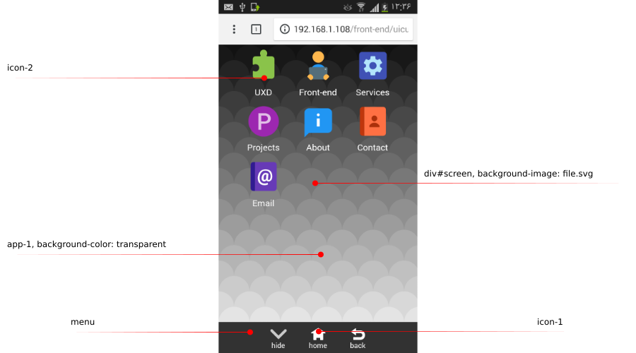

<h1 align="center" id="phonescape" >𝓹𝓱𝓸𝓷𝓮𝓼𝓬𝓹𝓪𝓮</h1>
<p align="center">
  &#9899; phonescape
  &#9898; <a href="#layout">layout</a>
  &#9898; <a href="#demo">demo</a>
  &#9898; <a href="#feature">feature</a>
  &#9898; <a href="#prerequisite">prerequisite</a>
  &#9898; <a href="#usage">usage</a>
  &#9898; <a href="#screenshots">screenshots</a>
  &#9898; <a href="#troubleshooting">troubleshooting</a>
  &#9898; <a href="#license">license</a>
</p>

A view or sense of smartphone layout in **responsive design**.  
A New and different approach to help smartphone users to have **simpler** and more **friendly** experience while they are using their phone and surfing the Internet, websites and web-applications.

<br>
<br>
<br>
<br>
<br>
<br>
<br>
<br>
<br>
<br>


<h1 align="center" id="layout" >𝓵𝓪𝔂𝓸𝓾𝓽</h1>
<p align="center">
  &#9898; <a href="#phonescape">phonescape</a>
  &#9899; layout
  &#9898; <a href="#demo">demo</a>
  &#9898; <a href="#feature">feature</a>
  &#9898; <a href="#prerequisite">prerequisite</a>
  &#9898; <a href="#usage">usage</a>
  &#9898; <a href="#screenshots">screenshots</a>
  &#9898; <a href="#troubleshooting">troubleshooting</a>
  &#9898; <a href="#license">license</a>
</p>

Here is the main layout. Think of the viewport from right to left. From icons to body element.


here is the result on Galaxy S3




<br>
<br>
<br>
<br>
<br>
<br>
<br>
<br>
<br>
<br>


<h1 align="center" id="demo" >𝓭𝓮𝓶𝓸</h1>
<p align="center">
  &#9898; <a href="#phonescape">phonescape</a>
  &#9898; <a href="#layout">layout</a>
  &#9899; demo
  &#9898; <a href="#feature">feature</a>
  &#9898; <a href="#prerequisite">prerequisite</a>
  &#9898; <a href="#usage">usage</a>
  &#9898; <a href="#screenshots">screenshots</a>
  &#9898; <a href="#troubleshooting">troubleshooting</a>
  &#9898; <a href="#license">license</a>
</p>

Simply visit:  
 - <a href="https://phonescape.uicuxd.com/">https://phonescape.uicuxd.com</a> online version.  
 - or locally using github page: <a href="https://uicuxd.github.io/phonescape/pure-css/">https://uicuxd.github.io/phonescape/pure-css</a> 

You can use Desktop browser, but it will be better to open it with your smartphone.
If you opened it with your browser, it would be better to change your browser's view to phone-view.  

<br>
<br>
<br>
<br>
<br>
<br>
<br>
<br>
<br>
<br>


<h1 align="center" id="feature" >𝓯𝓮𝓪𝓽𝓾𝓻𝓮</h1>
<p align="center">
  &#9898; <a href="#phonescape">phonescape</a>
  &#9898; <a href="#layout">layout</a>
  &#9898; <a href="#demo">demo</a>
  &#9899; features
  &#9898; <a href="#prerequisite">prerequisite</a>
  &#9898; <a href="#usage">usage</a>
  &#9898; <a href="#screenshots">screenshots</a>
  &#9898; <a href="#troubleshooting">troubleshooting</a>
  &#9898; <a href="#license">license</a>
</p>
 
 - pure and standard CSS, everything works with no `JS`
 - near 0% learning curve for end-users and developers (= front-end)
 - no headaches for front-end team or developers to take care of fitting their desktop-box-model into smartphone-box-model
 - good for new startups and businesses if they do not want to have separate mobile applications or cannot because of mobile applications' costs

<br>
<br>
<br>
<br>
<br>
<br>
<br>
<br>
<br>
<br>


<h1 align="center" id="prerequisite" >𝓹𝓻𝓮𝓻𝓮𝓺𝓾𝓲𝓼𝓲𝓽𝓮</h1>
<p align="center">
  &#9898; <a href="#phonescape">phonescape</a>
  &#9898; <a href="#layout">layout</a>
  &#9898; <a href="#demo">demo</a>
  &#9898; <a href="#feature">feature</a>
  &#9899; prerequisite
  &#9898; <a href="#usage">usage</a>
  &#9898; <a href="#screenshots">screenshots</a>
  &#9898; <a href="#troubleshooting">troubleshooting</a>
  &#9898; <a href="#license">license</a>
</p>

You should be really comfortable and even interest in pure `CSS` and `HTML` code. It is possible using `JS`, of course.
But thinking in pure `CSS` forces (for me it happens) our mind to understand layout very well; also caring more about details and accurate design.

Mostly you should be able:

 - to read `CSS` selectors and properties like reading **ABC**
 - to grasp **positioning** effect, specially `position: absolute`
 - to read `@media` queries and what it does very well
 - to read `SVG` source code very well
 
<br>
<br>
<br>
<br>
<br>
<br>
<br>
<br>
<br>
<br>


<h1 align="center" id="usage" >𝓾𝓼𝓪𝓰𝓮</h1>
<p align="center">
  &#9898; <a href="#phonescape">phonescape</a>
  &#9898; <a href="#layout">layout</a>
  &#9898; <a href="#demo">demo</a>
  &#9898; <a href="#feature">feature</a>
  &#9898; <a href="#prerequisite">prerequisite</a>
  &#9899; usage
  &#9898; <a href="#screenshots">screenshots</a>
  &#9898; <a href="#troubleshooting">troubleshooting</a>
  &#9898; <a href="#license">license</a>
</p>

Here is what you need:
 
 - Some SVG icons that show / illustrate your goal, for example an email icon
 - placing them (= SVGs) on the home screen
 - adding contents to each pseudo-app, for example your form in email's pseudo-app

<br>
<br>
<br>
<br>
<br>
<br>
<br>
<br>
<br>
<br>

<h1 align="center" id="screenshots">𝓼𝓬𝓻𝓮𝓮𝓷𝓼𝓱𝓸𝓽𝓼</h1>
<p align="center">
  &#9898; <a href="#phonescape">phonescape</a>
  &#9898; <a href="#layout">layout</a>
  &#9898; <a href="#demo">demo</a>
  &#9898; <a href="#feature">feature</a>
  &#9898; <a href="#prerequisite">prerequisite</a>
  &#9898; <a href="#usage">usage</a>
  &#9899; screenshots
  &#9898; <a href="#troubleshooting">troubleshooting</a>
  &#9898; <a href="#license">license</a>
</p>

<p align="center">
Let your users 𝙚𝙖𝙨𝙞𝙡𝙮 and 𝙛𝙖𝙨𝙩 grasp your site map / contents
</p>
<p align="center">
  
</p>

<p align="center">
Let them see your 𝙘𝙤𝙣𝙩𝙖𝙘𝙩 𝙞𝙣𝙛𝙤 in one touch / click, without scrolling
</p>
<p align="center">
  
</p>

<p align="center">
Let them 𝙡𝙞𝙨𝙩𝙚𝙣 𝙩𝙤 𝙢𝙪𝙨𝙞𝙘 while using your site or application
</p>
<p align="center">
  
</p>

<p align="center">
Let them the choice to use 𝙛𝙪𝙡𝙡 𝙨𝙘𝙧𝙚𝙚𝙣-𝙨𝙞𝙯𝙚
</p>
<p align="center">
  
</p>

<br>
<br>
<br>
<br>
<br>
<br>
<br>
<br>
<br>
<br>

<h1 align="center" id="troubleshooting" >𝓽𝓻𝓸𝓾𝓫𝓵𝓮𝓼𝓱𝓸𝓸𝓽𝓲𝓷𝓰</h1>
<p align="center">
  &#9898; <a href="#phonescape">phonescape</a>
  &#9898; <a href="#layout">layout</a>
  &#9898; <a href="#demo">demo</a>
  &#9898; <a href="#feature">feature</a>
  &#9898; <a href="#prerequisite">prerequisite</a>
  &#9898; <a href="#usage">usage</a>
  &#9898; <a href="#screenshots">screenshots</a>
  &#9899; troubleshooting
  &#9898; <a href="#license">license</a>
</p>

The first strange thing you will see is the absence of `JS` for handling active-page.
JavaScript can use a simple loop over each page and toggle active/inactive page. The same effect has been done using the `CSS` input element and UI-state pseudo-class.

```HTML
<!-- app-01 == home == icons -->
<input type="radio" id="control-app-01" name="app-controller" checked>
<div id="app-01">
    <!-- list of icons == apps -->
</div>
```

The second one is the `HTML` structure which is ordered from **bottom** to **top** not top to bottom.

```HTML
<div id="phone">
    <div id="screen">
        <div id="display">
            <!~- order is from bottom to top: 01 to 09 -->
            <div id="app-09"></div> <!~- simulate page 8 -->
            <div id="app-08"></div> <!~- simulate page 7 -->
            <div id="app-07"></div> <!~- simulate page 6 -->
            <div id="app-06"></div> <!~- simulate page 5 -->
            <div id="app-05"></div> <!~- simulate page 4 -->
            <div id="app-04"></div> <!~- simulate page 3 -->
            <div id="app-03"></div> <!~- simulate page 2 -->
            <div id="app-02"></div> <!~- simulate page 1 -->
            <div id="app-01"></div> <!~- simulate home screen -->
        </div>
    </div>
    <div id="menu"></div>
</div>
```

The third one is the absence of `.class` in `HTML` structure and `CSS` code. The two main reasons why I dislike using `.class` in `CSS` and `HTML`:

 1. for me (with a little background in `C` and `C++`) **CSS** `.class` is like `goto` keyword. It is powerful, but also dangerous. Search for the reason.
 2. I prefer looking at `CSS` code and know what the `HTML` structure is, other then always switching between CSS and HTML files.
 
To understand the second reason, try to guess the HTML structure by looking at the following two CSS code.  
Which one is more **illustrative**?

With classes:

```CSS
.phone { some-css-code; }
.screen { some-css-code; }
.display { some-css-code; }
#app-01 { some-css-code; }
```

What is `HTML` structure?

```HTML
<!-- I cannot guess -->
```

Without classes:

```CSS
div#phone { some-css-code; }
div#phone > div#screen { some-css-code; }
div#screen > div#display { some-css-code; }
div#display > div[id|="app"] { some-css-code; }
```

What is `HTML` structure?

```HTML
<div id="phone">
    <div id="screen">
        <div id="display">
            <div id="app-XX"></div>
        </div>
    </div>
</div>
```

<br>
<br>
<br>
<br>
<br>
<br>
<br>
<br>
<br>
<br>

<h1 align="center" id="license" >𝓵𝓲𝓬𝓮𝓷𝓼𝓮</h1>
<p align="center">
  &#9898; <a href="#phonescape">phonescape</a>
  &#9898; <a href="#layout">layout</a>
  &#9898; <a href="#demo">demo</a>
  &#9898; <a href="#feature">feature</a>
  &#9898; <a href="#prerequisite">prerequisite</a>
  &#9898; <a href="#usage">usage</a>
  &#9898; <a href="#screenshots">screenshots</a>
  &#9898; <a href="#troubleshooting">troubleshooting</a>
  &#9899; license
</p>

<p align="center">
  Copyright &copy; 2018 Shakiba Moshiri
  <br>
  <br>
  ▒█▀▄▀█ ▀█▀ ▀▀█▀▀<br>
  ▒█▒█▒█ ▒█░ ░▒█░░<br>
  ▒█░░▒█ ▄█▄ ░▒█░░<br>
</p>